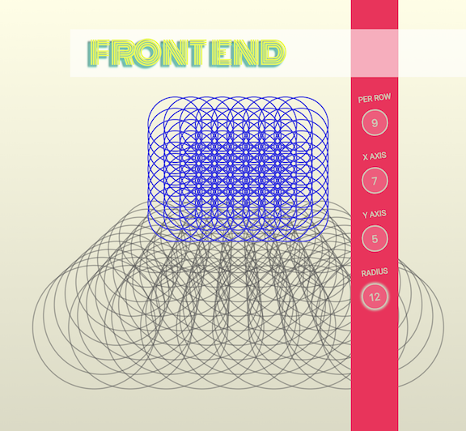

# Circle Grid

# circle-grid.petej.org

## Technologies
- [Create React App](https://github.com/facebookincubator/create-react-app)
- [Snap.svg](http://snapsvg.io/)

## Idea
A responsive svg art project built to have some fun. No css framework, just custom CSS styling. Mess around with some different grid configurations, see if you can find alerts. 

## Todo

- GridClass.createGrid() --> optionally return a promise to allow for larger more complex svg grids.
- On the front-end implement a loading spinner for slow building grids
- make inputs more friendly for mobile - sliders or arrows ... ?